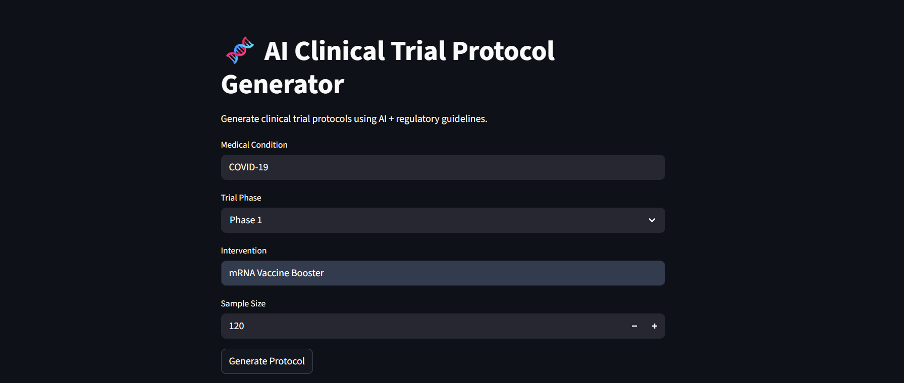
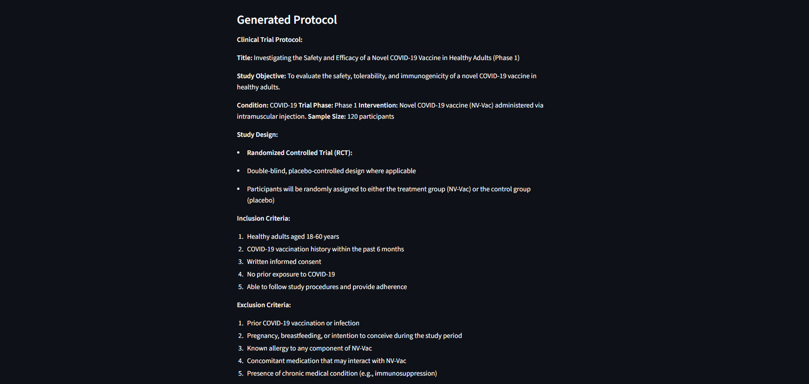
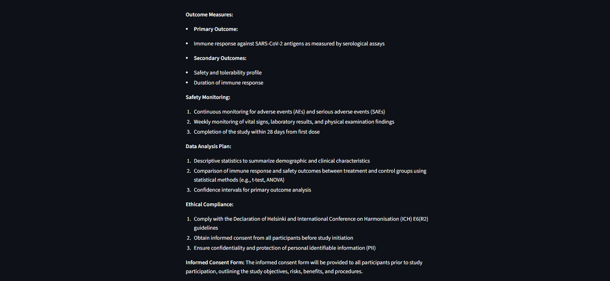

# AI Clinical Trial Protocol Generator

This project generates clinical trial protocols using AI and regulatory guidelines.
### Input Screen

### Output Screens

## Features

- Generates structured clinical trial protocols
- Uses AI to design study objectives and criteria
- Supports multiple diseases and interventions
- Built using Streamlit

## Inputs

- Medical Condition
- Trial Phase
- Intervention
- Sample Size

## Output

Generated clinical trial protocol including:

- Study Design
- Inclusion Criteria
- Exclusion Criteria
- Outcome Measures
- Safety Monitoring

## Installation

1. Clone the repository
2. Install dependencies

pip install -r requirements.txt

3. Run the app

streamlit run app.py
